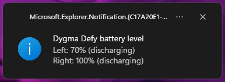
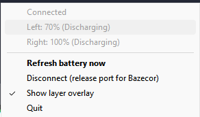

# dygmate

Tray app for checking Dygma Defy wireless battery status, on Windows and Linux.

On Linux the tray is a StatusNotifierItem over D-Bus, so it works in waybar and
other SNI-compatible bars/panels (Wayland). No X11/XEmbed. The Linux build has
no C dependencies (the D-Bus protocol is spoken directly) and links fully
statically.

Tiny runtime footprint: about 2.4 MB memory usage and very low CPU usage.

Shows desktop notifications on startup and when either side reaches a low
battery level. On Linux/Wayland, layer changes also show the same "Layer N"
overlay through zwlr-layer-shell. It requires a compositor with
`zwlr_layer_shell_v1` support (Hyprland, Sway, and KDE Plasma; not GNOME).
The tray menu's **Show layer overlay** toggle controls it. The surface uses
the `dygmate-osd` layer-shell namespace, so Hyprland users can apply rules
such as `layerrule = noanim, dygmate-osd`.

<p align="center">
   
   
  
</p>

<p align="center">
  
</p>

## Build

Requires [Zig 0.16.0](https://ziglang.org/download/).

Build for the host (produces the CLI `dygmate` and the tray `dygmate-tray`):

```sh
zig build -Doptimize=ReleaseSmall
```

Cross-build both platforms at once into `zig-out/{windows,linux}/`:

```sh
zig build release
```

Run the tray directly:

```sh
zig build run-tray-linux   # Linux
zig build run-tray         # Windows
```

## Linux setup

### Serial port permissions

The keyboard shows up as a CDC-ACM serial device (`/dev/ttyACM0`). By default
it's owned by `root` and a serial group, so a normal user can't open it and
dygmate reports:

```
failed to open /dev/ttyACM0 (AccessDenied) ...
```

Fix it one of two ways.

**Add your user to the serial group** (simplest). Check the device's group
first:

```sh
ls -l /dev/ttyACM0     # e.g. crw-rw---- root uucp ...
```

Then join that group — `uucp` on Arch, `dialout` on Debian/Ubuntu:

```sh
sudo usermod -aG uucp "$USER"     # or: dialout
```

Log out and back in (or run `newgrp uucp`) for it to take effect.

**Or install a udev rule** (targeted to the Dygma, no group change, survives
replug):

```sh
echo 'SUBSYSTEM=="tty", ATTRS{idVendor}=="35ef", ATTRS{idProduct}=="0012", MODE="0660", TAG+="uaccess"' \
  | sudo tee /etc/udev/rules.d/99-dygma.rules
sudo udevadm control --reload-rules && sudo udevadm trigger
```

`TAG+="uaccess"` grants access to the user of the active login session, so no
group membership is needed and it works for the tray too.

Close Bazecor before running dygmate either way — the serial port is exclusive.

### Tray

The Linux tray is a StatusNotifierItem, shown by any SNI host: waybar, KDE
Plasma, and others. In waybar, add the `tray` module to your config:

```jsonc
{
  "modules-right": ["tray"],
  "tray": { "spacing": 8 }
}
```

Start `dygmate-tray` (e.g. from your compositor's autostart). Left-click the
icon to refresh; right-click for the menu.
